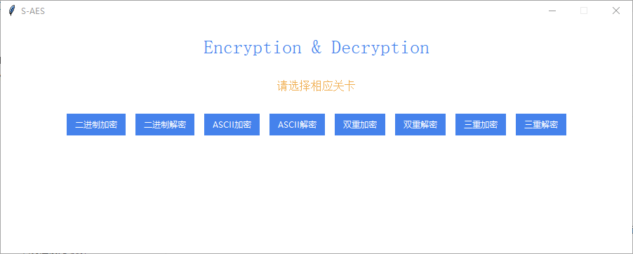
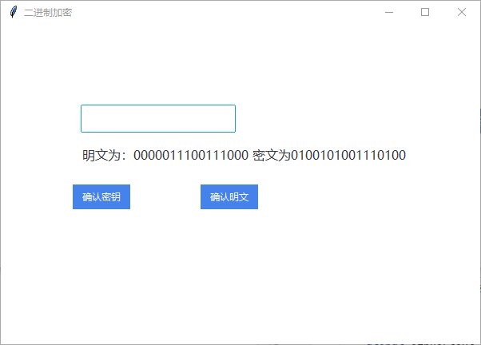
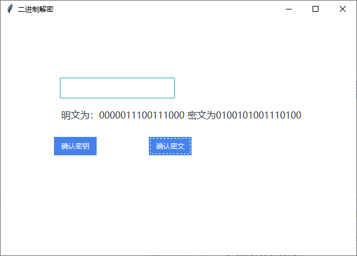
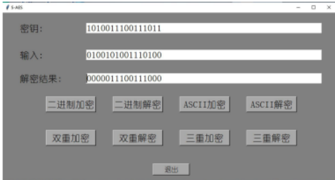
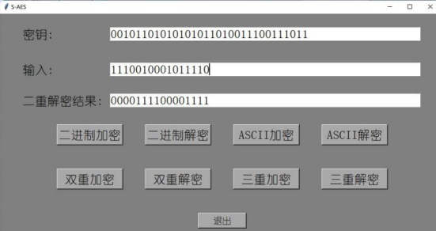
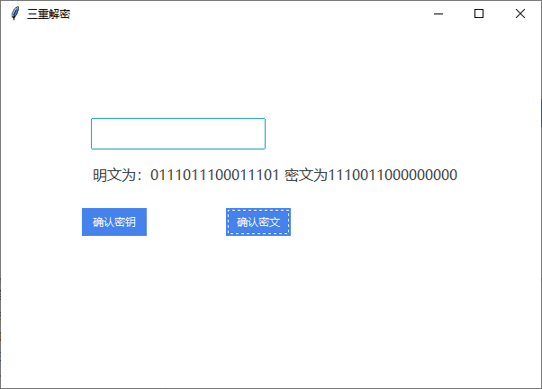
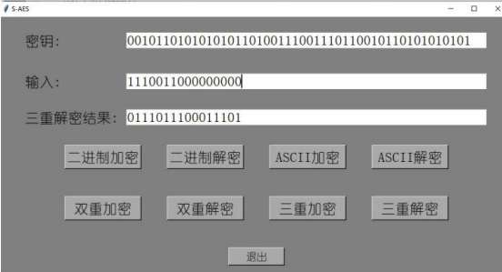
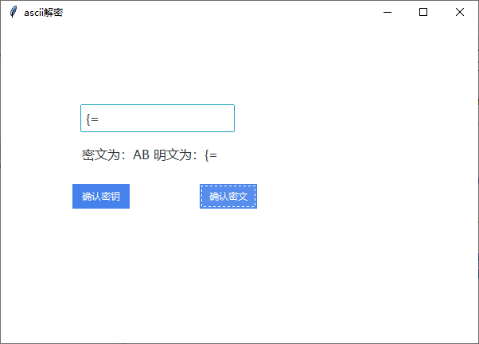
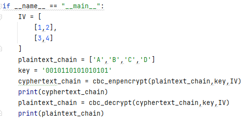
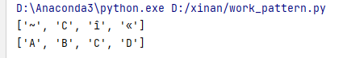

# S-AES

## 作业报告

### Rebel小组  成员：唐一月  翁嘉阳

### 实现功能：

二进制加密、二进制解密、ASCII 加密、ASCII 解密、双重加密、双重解密、三重加密、三重解密、CBC模式

### GUI界面及其功能展示



#### 二进制加密、解密






交叉测试结果：



#### 双重加密、解密


交叉测试：



#### 三重加密、解密




交叉测试：



#### ascii加密解密




#### CBC模式





### 关键代码

#### S-AES

```python
# S-盒
s_box = [
    0x9, 0x4, 0xA, 0xB,
    0xD, 0x1, 0x8, 0x5,
    0x6, 0x2, 0x0, 0x3,
    0xC, 0xE, 0xF, 0x7
]
inverse_s_box = [
    0xA, 0X5, 0x9, 0xB,
    0x1, 0x7, 0x8, 0xF,
    0x6, 0x0, 0x2, 0x3,
    0xC, 0x4, 0xD, 0xE
]
#混淆函数
mix_function = [[1,4],
                [4,1]]
inverse_mix_function = [[9,2],
                        [2,9]]
#密钥扩展
#SubNib:
def SubNib(input_byte, s_box):
    # 将输入拆分为两个4位的部分
    left_half = input_byte[:4]
    right_half = input_byte[4:]

    # 使用自定义的S-盒替代
    substituted_left_half = bin(s_box[int(left_half, 2)])[2:].zfill(4)
    substituted_right_half = bin(s_box[int(right_half, 2)])[2:].zfill(4)

    # 合并替代后的两个部分
    substituted_byte = substituted_left_half + substituted_right_half

    return substituted_byte
def RotNib(input_byte):
    # 将输入拆分为两个4位的部分
    left_half = input_byte[:4]
    right_half = input_byte[4:]

    # 进行左循环移位
    rotated_byte = right_half + left_half

    return rotated_byte

def expand_key(key,s_box):
    Round_Constant_1 = 0b10000000
    Round_Constant_2 = 0b00110000
    w0 = key[0:8]
    w1 = key[8:16]
    w1_substituted = RotNib(w1)
    w1_substituted = SubNib(w1_substituted, s_box)

    w2 = int(w0, 2) ^ Round_Constant_1 ^ int(w1_substituted, 2)
    w2 = bin(w2)[2:].zfill(8)

    w3 = int(w2,2) ^ int(w1,2)
    w3 = bin(w3)[2:].zfill(8)
    w3_substituted1 = RotNib(w3)
    w3_substituted = SubNib(w3_substituted1,s_box)

    w4 = int(w2,2) ^ Round_Constant_2 ^ int(w3_substituted,2)
    w4 = bin(w4)[2:].zfill(8)

    w5 = int(w4,2) ^int(w3,2)
    w5 = bin(w5)[2:].zfill(8)

    return w0,w1,w2,w3,w4,w5

#function
#密钥加
def round_key_addition(plaintext, w0, w1):
    key = [int(w0[0:4],2),int(w0[4:8],2),
           int(w1[0:4],2),int(w1[4:8],2)]
    
    # 对plaintext中的每个字节进行轮密钥加操作
    encrypted_text = []
    for i in range(4):
        encrypted_text.append(int(hex(plaintext[i]^key[i]),16))

    return encrypted_text

#半字节代替
def SubNibble(input_nibble, s_box):
    input_int = int(input_nibble, 2)
    substituted_nibble = s_box[input_int]
    return substituted_nibble

def subNibble_list(plaintext, s_box):
    substituted_result = []
    for number in plaintext:
        hex_str = hex(number)[2:].zfill(2)  # 转换为2位的十六进制字符串
        binary_str = format(int(hex_str, 16), '04b')  # 转换为4位的二进制字符串
        substituted_nibble = SubNibble(binary_str, s_box)
        substituted_result.append(substituted_nibble)
    return substituted_result

#行位移
def shift_rows(matrix):
    # 对矩阵的第二行进行行位移
    matrix = [
            [matrix[0],matrix[2]],
            [matrix[1],matrix[3]]
            ]
    matrix[1] = matrix[1][1:] + matrix[1][:1]

    return matrix

#列混淆
def multiply(a, b):
    bin_a = bin(a)[2:].zfill(4)  # 转换为4位二进制
    bin_b = bin(b)[2:].zfill(4)  # 转换为4位二进制
    result_bin = gf4_multiply(bin_a, bin_b)
    result_decimal = int(result_bin, 2)
    return result_decimal
# GF(2^4) 乘法函数
def gf4_multiply(a, b):
    int_a = int(a, 2)
    int_b = int(b, 2)
    irreducible_poly = int('10011', 2)
    product = 0
    for i in range(4):
        if int_b & 1:
            product ^= int_a
        if int_a & 0x08:
            int_a = (int_a << 1) ^ irreducible_poly
        else:
            int_a <<= 1
        int_b >>= 1
    result = format(product, '04b')
    return result

def mix_column(plaintext,mix_function):
    plaintext_prime = [[0,0],[0,0]]
    plaintext_prime[0][0] = multiply(mix_function[0][0],plaintext[0][0])^multiply(mix_function[0][1],plaintext[1][0])
    plaintext_prime[1][0] = multiply(mix_function[1][0],plaintext[0][0])^multiply(mix_function[1][1],plaintext[1][0])
    plaintext_prime[0][1] = multiply(mix_function[0][0],plaintext[0][1])^multiply(mix_function[0][1],plaintext[1][1])
    plaintext_prime[1][1] = multiply(mix_function[1][0],plaintext[0][1])^multiply(mix_function[1][1],plaintext[1][1])
    return plaintext_prime

def normalization(plaintext):
    plaintext_normalization = [plaintext[0][0],plaintext[1][0],plaintext[0][1],plaintext[1][1]]
    return plaintext_normalization

def normalization_matrix(plaintext):
    plaintext_martix = [[plaintext[0],plaintext[2]],
                        [plaintext[1],plaintext[3]]
                        ]
    return plaintext_martix
#加密
def saes_encrypt(plaintext,key):
    w0,w1,w2,w3,w4,w5 = expand_key(key,s_box)
    plaintext = normalization(plaintext)
    plaintext = round_key_addition(plaintext,w0,w1)
    plaintext = subNibble_list(plaintext,s_box)
    plaintext = shift_rows(plaintext)
    plaintext = mix_column(plaintext,mix_function)
    plaintext = normalization(plaintext)
    plaintext = round_key_addition(plaintext,w2,w3)
    plaintext = subNibble_list(plaintext,s_box)
    plaintext = shift_rows(plaintext)
    plaintext = normalization(plaintext)
    plaintext = round_key_addition(plaintext,w4,w5)
    cyphertext = normalization_matrix(plaintext)
    return cyphertext
    
#解密
def saes_decrypt(cyphertext,key):
    w0,w1,w2,w3,w4,w5 = expand_key(key,s_box)
    cyphertext = normalization(cyphertext)
    cyphertext = round_key_addition(cyphertext,w4,w5)
    cyphertext = shift_rows(cyphertext) 
    cyphertext = normalization(cyphertext)
    cyphertext = subNibble_list(cyphertext,inverse_s_box) 
    cyphertext = round_key_addition(cyphertext,w2,w3) 
    cyphertext = normalization_matrix(cyphertext)
    cyphertext = mix_column(cyphertext,inverse_mix_function)
    cyphertext = normalization(cyphertext) 
    cyphertext = shift_rows(cyphertext)
    cyphertext = normalization(cyphertext)
    cyphertext = subNibble_list(cyphertext,inverse_s_box)
    plaintext = round_key_addition(cyphertext,w0,w1)
    plaintext = normalization_matrix(plaintext)
    return plaintext


if __name__ == "__main__":
    # plaintext = [[10,4],[7,9]]
    # plaintext = '1111111111111111'
    plaintext='0000011100111000'
    num1 = int(plaintext[0:4], 2)
    num2 = int(plaintext[4:8], 2)
    num3 = int(plaintext[8:12], 2)
    num4 = int(plaintext[12:16], 2)
    plaintext = [[num1, num2], [num3, num4]]
    plaintext=[[10,4],[7,9]]
    print(plaintext)
    key = '0010110101010101'
    cyphertext = saes_encrypt(plaintext,key)
    c1 = "{:0>4d}".format(int(bin(cyphertext[0][0])[2:]))
    c2 = "{:0>4d}".format(int(bin(cyphertext[0][1])[2:]))
    c3 = "{:0>4d}".format(int(bin(cyphertext[1][0])[2:]))
    c4 = "{:0>4d}".format(int(bin(cyphertext[1][1])[2:]))
    cc = c1+c2+c3+c4 #密文转为二进制
    print(cc)
    num1 = int(cc[0:4], 2)
    num2 = int(cc[4:8], 2)
    num3 = int(cc[8:12], 2)
    num4 = int(cc[12:16], 2)
    plaintext = [[num1, num2], [num3, num4]]
    print(plaintext)
    plaintext = saes_decrypt(cyphertext,key)
    print(cyphertext)
    print(plaintext)

```

#### ascii_aes

```python
import aes
def normalization(plaintext):
    plaintext_normalization = [plaintext[0][0],plaintext[0][1],plaintext[1][0],plaintext[1][1]]
    return plaintext_normalization
def normalization_matrix(plaintext):
    plaintext_martix = [[plaintext[0],plaintext[1]],
                        [plaintext[2],plaintext[3]]
                        ]
    return plaintext_martix
#character to integer（十进制）
def asc_to_bin(plaintext_char):
    plaintext_int = []
    a_hex = hex(ord(plaintext_char[0]))
    b_hex = hex(ord(plaintext_char[1]))
    for i in range(2):
        plaintext_int.append(int(a_hex[i+2],16))
        plaintext_int.append(int(b_hex[i+2],16))
    return plaintext_int
#character to integer（十进制）
def bin_to_asc(cyphertext_hex):
    cyphertext_char = []
    a_char = chr(cyphertext_hex[0]*16+cyphertext_hex[2])
    b_char = chr(cyphertext_hex[1]*16+cyphertext_hex[3])
    cyphertext_char.append(a_char)
    cyphertext_char.append(b_char)
    return cyphertext_char

def saes_encrypt_asc(plaintext_char,key):
    plaintext_int = asc_to_bin(plaintext_char)
    plaintext_int = normalization_matrix(plaintext_int)
    cyphertext_int = aes.saes_encrypt(plaintext_int,key)
    cyphertext_int = normalization(cyphertext_int)
    cyphertext_char = bin_to_asc(cyphertext_int)
    return cyphertext_char

def saes_decrypt_asc(cyphertext_char,key):
    cyphertext_int = asc_to_bin(cyphertext_char)
    cyphertext_int = normalization_matrix(cyphertext_int)
    plaintext_int = aes.saes_decrypt(cyphertext_int,key)
    plaintext_int = normalization(plaintext_int)
    plaintext_char = bin_to_asc(plaintext_int)
    return plaintext_char

if __name__ == "__main__":
    key = '0010110101010101'
    plaintext_char = ['A', 'B']
    cyphertext_char =saes_encrypt_asc(plaintext_char,key)
    print(cyphertext_char)
    plaintext_char = saes_decrypt_asc(cyphertext_char,key)
    print(plaintext_char)
```

#### multi_encryption

```python
import aes
#双重加解密（这里的key是32bit）
def double_saes_encrypt(plaintext,key):
    key_0 = key[:16]
    key_1 = key[16:]
    cyphertext = aes.saes_encrypt(plaintext,key_0)
    cyphertext = aes.saes_encrypt(cyphertext,key_1)
    return cyphertext
def double_saes_decrypt(cyphertext,key):
    key_0 = key[:16]
    key_1 = key[16:]
    plaintext = aes.saes_decrypt(cyphertext,key_1)
    plaintext = aes.saes_decrypt(plaintext,key_0)
    return plaintext
#中间相遇攻击（要算很久，不用测试了）（这里的key也是32bit）
def meet_in_the_middle_attack(plaintext,cyphertext)-> list :
    middle_key_list = []
    for i in range(65534):
        key_0 = bin(i)[2:].zfill(16)
        for j in range(65534):
            key_1 = bin(j)[2:].zfill(16)
            plaintext_middle = aes.saes_encrypt(plaintext,key_0)
            cyphertext_middle = aes.saes_decrypt(cyphertext,key_1)
            if plaintext_middle == cyphertext_middle:
                middle_key_list.append(key_0+key_1)   
    return middle_key_list

#三重加密（这里的key是48bit）
def treble_saes_encrypt(plaintext,key):
    key_0 = key[:16]
    key_1 = key[16:32]
    key_2 = key[32:]
    cyphertext = aes.saes_encrypt(plaintext,key_0)
    cyphertext = aes.saes_encrypt(cyphertext,key_1)
    cyphertext = aes.saes_encrypt(cyphertext,key_2)
    return cyphertext
def treble_saes_decrypt(cyphertext,key):
    key_0 = key[:16]
    key_1 = key[16:]
    key_2 = key[32:]
    plaintext = aes.saes_decrypt(cyphertext,key_2)
    plaintext = aes.saes_decrypt(plaintext,key_1)
    plaintext = aes.saes_decrypt(plaintext,key_0)
    return plaintext

if __name__ == "__main__":
    key = '0010110101010101'+'0010110101010101'
    key = '00101101010101010010110101010101'
    plaintext = [[10,4],[7,9]]
    cyphertext = double_saes_encrypt(plaintext,key)
    print(cyphertext)
    plaintext = double_saes_decrypt(cyphertext,key)
    print(plaintext)
    middle_key_list = meet_in_the_middle_attack(plaintext,cyphertext)
    print(middle_key_list)
```

#### CBC

```PYTHON
import aes
import ascii_aes

def xor(tensor1,tensor2)->list:
    result = [[0,0],[0,0]]
    for i in range(2):
        for j in range(2):
            result[i][j] = tensor1[i][j] ^ tensor2[i][j]
    return result

def normalization_matrix(List):
    tensor = [[List[0],List[1]],[List[2],List[3]]]
    return tensor

def normalization(tensor):
    return [item for sublist in tensor for item in sublist]

def cbc_enpencrypt(plaintext_chain,key,IV):
    chain_length = len(plaintext_chain)
    block_length = int(chain_length/2)
    cyphertext_chain = []
    plaintext_block = []
    middle_block = [[] for _ in range(block_length)]
    cyphertext_block = [[] for _ in range(block_length)]

    #分块
    for i in range(0, chain_length, 2):
        plaintext_block.append(plaintext_chain[i:i+2])
    for p in range(block_length):
        plaintext_block[p] = ascii_aes.asc_to_bin(plaintext_block[p])
        plaintext_block[p] = normalization_matrix(plaintext_block[p])
    for j in range(block_length):
        #异或
        middle_block[j] = xor(plaintext_block[j],IV)
        #加密
        cyphertext_block[j]= aes.saes_encrypt(middle_block[j],key)
        IV = cyphertext_block[j]
    # cyphertext_block = normalization(cyphertext_block)
    for q in range(block_length):
        cyphertext_block[q] = normalization(cyphertext_block[q])
        cyphertext_block[q] = ascii_aes.bin_to_asc(cyphertext_block[q])
    cyphertext_chain = normalization(cyphertext_block)
    return cyphertext_chain
# [[7, 4], [14, 3]] -> [7,4,14,3]
def cbc_decrypt(cyphertext_chain,key,IV):
    chain_length = len(cyphertext_chain)
    block_length = int(chain_length/2)
    plaintext_chain = []
    cyphertext_block = []
    middle_block = [[] for _ in range(block_length)]
    plaintext_block = [[] for _ in range(block_length)]
    #分块
    for i in range(0, chain_length, 2):
        cyphertext_block.append(cyphertext_chain[i:i+2])
    for p in range(block_length):
        cyphertext_block[p] = ascii_aes.asc_to_bin(cyphertext_block[p])
        cyphertext_block[p] = normalization_matrix(cyphertext_block[p])
    for j in range(block_length):
        #解密
        middle_block[j]= aes.saes_decrypt(cyphertext_block[j],key)
        #异或
        plaintext_block[j] = xor(middle_block[j],IV)
        IV = cyphertext_block[j]
    for q in range(block_length):
        plaintext_block[q] = normalization(plaintext_block[q])
        plaintext_block[q] = ascii_aes.bin_to_asc(plaintext_block[q])
    plaintext_chain = normalization(plaintext_block)
    return plaintext_chain

if __name__ == "__main__":
    IV = [
        [1,2],
        [3,4]
    ]
    plaintext_chain = ['A','B','C','D']
    key = '0010110101010101'
    cyphertext_chain = cbc_enpencrypt(plaintext_chain,key,IV)
    print(cyphertext_chain)
    plaintext_chain = cbc_decrypt(cyphertext_chain,key,IV)
    print(plaintext_chain)
```

#### UI界面

```python
import ttkbootstrap as ttk
import tkinter as tk
from tkinter import *
from ttkbootstrap import StringVar
from aes import saes_encrypt
from aes import saes_decrypt
from ascii_aes import saes_encrypt_asc
from ascii_aes import saes_decrypt_asc
from multi_encryption import double_saes_encrypt
from multi_encryption import double_saes_decrypt
from multi_encryption import treble_saes_encrypt
from multi_encryption import treble_saes_decrypt

key = []
plaintext = []
ciphertext = []


# button1 得到第一次输入，并对不符合输入规范的操作进行提示
def getText1(input1, l_text, fn):
    if (fn == 0 or fn == 1 or fn == 3 or fn == 4):
        if (len(input1.get()) != 16):
            text = '输入密钥不符合16位规范'
            l_text.set(text)
            return
    elif(fn==5 or fn==6):
        if(len(input1.get())!=32):
            text = '输入密钥不符合32位规范'
            l_text.set(text)
            return
    elif (fn == 7 or fn == 8):
        if (len(input1.get()) != 48):
            text = '输入密钥不符合48位规范'
            l_text.set(text)
            return
    global key
    key = str(input1.get())
    input1.delete(0, "end")
    if (fn == 0 or fn==5 or fn ==7):
        text = '请输入16位明文。'
    elif (fn == 1 or fn==6 or fn==8):
        text = '请输入16位密文。'
    elif (fn == 3 or fn == 4):
        text = '请输入字符串'
        l_text.set(text)
        return


# button2 得到第二次输入，调用函数实现最终功能，并展现结果
def getText2(input1, l_text, fn):
    if (fn == 0):
        if (len(input1.get()) != 16):
            text = '输入明文不符合16位规范'
            l_text.set(text)
            return
        global plaintext
        plaintext = str(input1.get())
        plaintext_new = plaintext
        num1 = int(plaintext[0:4],2)
        num2 = int(plaintext[4:8],2)
        num3 = int(plaintext[8:12], 2)
        num4 = int(plaintext[12:16], 2)
        plaintext=[[num1,num2],[num3,num4]]
        print(plaintext)
        ciphertext1 = saes_encrypt(plaintext, key)
        c1 = "{:0>4d}".format(int(bin(ciphertext1[0][0])[2:]))
        c2 = "{:0>4d}".format(int(bin(ciphertext1[0][1])[2:]))
        c3 = "{:0>4d}".format(int(bin(ciphertext1[1][0])[2:]))
        c4 = "{:0>4d}".format(int(bin(ciphertext1[1][1])[2:]))
        ciphertext1 = c1 + c2 + c3 + c4
        str1 = plaintext_new
        str2 = ciphertext1
        text = '明文为：' + str1 + ' 密文为' + str2
        print(text)
        l_text.set(text)
        input1.delete(0, "end")
        return
    elif (fn == 1):
        if (len(input1.get()) != 16):
            text = '输入密文不符合16位规范'
            l_text.set(text)
            return
        global ciphertext
        ciphertext = str(input1.get())
        ciphertext_new = ciphertext
        num1 = int(ciphertext[0:4], 2)
        num2 = int(ciphertext[4:8], 2)
        num3 = int(ciphertext[8:12], 2)
        num4 = int(ciphertext[12:16], 2)
        ciphertext = [[num1, num2], [num3, num4]]
        plaintext1 = saes_decrypt(ciphertext, key)
        c1 = "{:0>4d}".format(int(bin(plaintext1[0][0])[2:]))
        c2 = "{:0>4d}".format(int(bin(plaintext1[0][1])[2:]))
        c3 = "{:0>4d}".format(int(bin(plaintext1[1][0])[2:]))
        c4 = "{:0>4d}".format(int(bin(plaintext1[1][1])[2:]))
        str1 = c1 + c2 + c3 + c4
        str2 = ciphertext_new
        text = '明文为：' + str1 + ' 密文为' + str2
        l_text.set(text)
        print(text)
        input1.delete(0, "end")
        return
    elif (fn == 3):
        plaintext2 = input1.get()
        if (len(plaintext2) == 0):
            text = '输入不能为空'
            l_text.set(text)
            return
        plaintext_char = list(plaintext2)

        text = saes_encrypt_asc(plaintext_char, key)
        text = "".join(text)
        text = '明文为：' + plaintext2 + ' 密文为：' + text
        l_text.set(text)
    elif (fn == 4):
        ciphertext2 = input1.get()
        if (len(ciphertext2) == 0):
            text = '输入不能为空'
            l_text.set(text)
            return
        ciphertext_char=list(ciphertext2)
        text = saes_decrypt_asc(ciphertext_char, key)
        text = "".join(text)
        text = '密文为：' + text + ' 明文为：' + ciphertext2
        l_text.set(text)
    elif (fn == 5):
        if (len(input1.get()) != 16):
            text = '输入明文不符合16位规范'
            l_text.set(text)
            return
        plaintext = str(input1.get())
        plaintext_new = plaintext
        num1 = int(plaintext[0:4],2)
        num2 = int(plaintext[4:8],2)
        num3 = int(plaintext[8:12], 2)
        num4 = int(plaintext[12:16], 2)
        plaintext=[[num1,num2],[num3,num4]]
        print(plaintext)
        ciphertext1 = double_saes_encrypt(plaintext, key)
        c1 = "{:0>4d}".format(int(bin(ciphertext1[0][0])[2:]))
        c2 = "{:0>4d}".format(int(bin(ciphertext1[0][1])[2:]))
        c3 = "{:0>4d}".format(int(bin(ciphertext1[1][0])[2:]))
        c4 = "{:0>4d}".format(int(bin(ciphertext1[1][1])[2:]))
        ciphertext1 = c1 + c2 + c3 + c4
        str1 = plaintext_new
        str2 = ciphertext1
        text = '明文为：' + str1 + ' 密文为' + str2
        print(text)
        l_text.set(text)
        input1.delete(0, "end")
        return
    elif (fn == 6):
        if (len(input1.get()) != 16):
            text = '输入密文不符合16位规范'
            l_text.set(text)
            return
        ciphertext = str(input1.get())
        ciphertext_new = ciphertext
        num1 = int(ciphertext[0:4], 2)
        num2 = int(ciphertext[4:8], 2)
        num3 = int(ciphertext[8:12], 2)
        num4 = int(ciphertext[12:16], 2)
        ciphertext = [[num1, num2], [num3, num4]]
        plaintext1 = double_saes_decrypt(ciphertext, key)
        c1 = "{:0>4d}".format(int(bin(plaintext1[0][0])[2:]))
        c2 = "{:0>4d}".format(int(bin(plaintext1[0][1])[2:]))
        c3 = "{:0>4d}".format(int(bin(plaintext1[1][0])[2:]))
        c4 = "{:0>4d}".format(int(bin(plaintext1[1][1])[2:]))
        str1 = c1 + c2 + c3 + c4
        str2 = ciphertext_new
        text = '明文为：' + str1 + ' 密文为' + str2
        l_text.set(text)
        print(text)
        input1.delete(0, "end")
        return
    elif (fn == 7):
        if (len(input1.get()) != 16):
            text = '输入明文不符合16位规范'
            l_text.set(text)
            return
        plaintext = str(input1.get())
        plaintext_new = plaintext
        num1 = int(plaintext[0:4],2)
        num2 = int(plaintext[4:8],2)
        num3 = int(plaintext[8:12], 2)
        num4 = int(plaintext[12:16], 2)
        plaintext=[[num1,num2],[num3,num4]]
        print(plaintext)
        ciphertext1 = treble_saes_encrypt(plaintext, key)
        c1 = "{:0>4d}".format(int(bin(ciphertext1[0][0])[2:]))
        c2 = "{:0>4d}".format(int(bin(ciphertext1[0][1])[2:]))
        c3 = "{:0>4d}".format(int(bin(ciphertext1[1][0])[2:]))
        c4 = "{:0>4d}".format(int(bin(ciphertext1[1][1])[2:]))
        ciphertext1 = c1 + c2 + c3 + c4
        str1 = plaintext_new
        str2 = ciphertext1
        text = '明文为：' + str1 + ' 密文为' + str2
        print(text)
        l_text.set(text)
        input1.delete(0, "end")
        return
    elif (fn == 8):
        if (len(input1.get()) != 16):
            text = '输入密文不符合16位规范'
            l_text.set(text)
            return
        ciphertext = str(input1.get())
        ciphertext_new = ciphertext
        num1 = int(ciphertext[0:4], 2)
        num2 = int(ciphertext[4:8], 2)
        num3 = int(ciphertext[8:12], 2)
        num4 = int(ciphertext[12:16], 2)
        ciphertext = [[num1, num2], [num3, num4]]
        plaintext1 = treble_saes_decrypt(ciphertext, key)
        c1 = "{:0>4d}".format(int(bin(plaintext1[0][0])[2:]))
        c2 = "{:0>4d}".format(int(bin(plaintext1[0][1])[2:]))
        c3 = "{:0>4d}".format(int(bin(plaintext1[1][0])[2:]))
        c4 = "{:0>4d}".format(int(bin(plaintext1[1][1])[2:]))
        str1 = c1 + c2 + c3 + c4
        str2 = ciphertext_new
        text = '明文为：' + str1 + ' 密文为' + str2
        l_text.set(text)
        print(text)
        input1.delete(0, "end")
        return
# 跳转页面
def create(fun):
    # 定义StringVar
    l_text = StringVar()
    # 初始化数据
    childW1 = Toplevel(frame)  # 创建子窗口
    childW1.geometry("600x400")
    if (fun == 0):
        text = "请输入16位密钥"
        l_text.set(text)
        childW1.title('二进制加密')
        b1 = ttk.Button(childW1, text="确认密钥", command=lambda: getText1(input1, l_text, 0))
        b2 = ttk.Button(childW1, text="确认明文", command=lambda: getText2(input1, l_text, 0))
    elif (fun == 1):
        text = "请输入16位密钥"
        l_text.set(text)
        childW1.title('二进制解密')
        b1 = ttk.Button(childW1, text="确认密钥", command=lambda: getText1(input1, l_text, 1))
        b2 = ttk.Button(childW1, text="确认密文", command=lambda: getText2(input1, l_text, 1))
    elif (fun == 3):
        text = "请输入16位密钥"
        l_text.set(text)
        childW1.title('ascii加密')
        b1 = ttk.Button(childW1, text="确认密钥", command=lambda: getText1(input1, l_text, 3))
        b2 = ttk.Button(childW1, text="确认明文", command=lambda: getText2(input1, l_text, 3))
    elif (fun == 4):
        text = "请输入16位密钥"
        l_text.set(text)
        childW1.title('ascii解密')
        b1 = ttk.Button(childW1, text="确认密钥", command=lambda: getText1(input1, l_text, 4))
        b2 = ttk.Button(childW1, text="确认密文", command=lambda: getText2(input1, l_text, 4))
    elif (fun == 5):
        text = "请输入32位密钥"
        l_text.set(text)
        childW1.title('双重加密')
        b1 = ttk.Button(childW1, text="确认密钥", command=lambda: getText1(input1, l_text, 5))
        b2 = ttk.Button(childW1, text="确认明文", command=lambda: getText2(input1, l_text, 5))
    elif (fun == 6):
        text = "请输入32位密钥"
        l_text.set(text)
        childW1.title('双重解密')
        b1 = ttk.Button(childW1, text="确认密钥", command=lambda: getText1(input1, l_text, 6))
        b2 = ttk.Button(childW1, text="确认密文", command=lambda: getText2(input1, l_text, 6))
    elif (fun == 7):
        text = "请输入48位密钥"
        l_text.set(text)
        childW1.title('三重加密')
        b1 = ttk.Button(childW1, text="确认密钥", command=lambda: getText1(input1, l_text, 7))
        b2 = ttk.Button(childW1, text="确认明文", command=lambda: getText2(input1, l_text, 7))
    elif (fun == 8):
        text = "请输入48位密钥"
        l_text.set(text)
        childW1.title('三重解密')
        b1 = ttk.Button(childW1, text="确认密钥", command=lambda: getText1(input1, l_text, 8))
        b2 = ttk.Button(childW1, text="确认密文", command=lambda: getText2(input1, l_text, 8))

    input1 = ttk.Entry(childW1, bootstyle="info", font=("微软雅黑", 12))
    input1.place(x=100, y=100)
    label = ttk.Label(childW1, textvariable=l_text, font=("微软雅黑", 12))
    label.place(x=100, y=150)
    b1.place(x=90, y=200)
    b2.place(x=250, y=200)

# 创建窗体
win = tk.Tk()
win.title("S-AES")
win.geometry("900x330")
win.resizable(False, False)  # 不允许改变窗口大小

# 创建一个容器来包括其他控件
frame = ttk.Frame(win)

frame.pack()

# 标题
title = ttk.Label(frame, text='Encryption & Decryption', font=("bold", 20), bootstyle='primary')
title.pack(padx=10, pady=20)
# 关卡提示
info = ttk.Label(frame, text='请选择相应关卡', bootstyle='warning', font=15)
info.pack(padx=10, pady=10)
# 按钮
b1 = ttk.Button(frame, text="二进制加密", command=lambda: create(0))
b1.pack(padx=7,pady=10, side='left')

b2 = ttk.Button(frame, text="二进制解密", command=lambda: create(1))
b2.pack(padx=7,pady=10, side='left')

b4 = ttk.Button(frame, text="ASCII加密", command=lambda: create(3))
b4.pack(padx=7,pady=10, side='left')

b5 = ttk.Button(frame, text="ASCII解密", command=lambda: create(4))
b5.pack(padx=7,pady=10, side='left')

b4 = ttk.Button(frame, text="双重加密", command=lambda: create(5))
b4.pack(padx=7,pady=20, side='left')

b6 = ttk.Button(frame, text="双重解密", command=lambda: create(6))
b6.pack(padx=7,pady=20, side='left')

b7 = ttk.Button(frame, text="三重加密", command=lambda: create(7))
b7.pack(padx=7,pady=20, side='left')

b8 = ttk.Button(frame, text="三重解密", command=lambda: create(8))
b8.pack(padx=7,pady=20, side='left')

frame.mainloop()
```